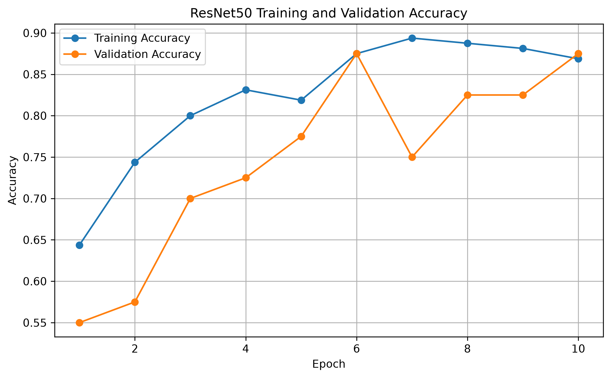

# 🧠 Brain Tumor Detection API

A deep learning–based brain tumor classification system using **PyTorch, ResNet50, FastAPI, and Docker**.

The system analyzes an uploaded brain MRI image and predicts whether it belongs to the **Brain Tumor** or **Normal** class, along with a confidence score.

> **Medical disclaimer:** This project is intended for educational, research, and software demonstration purposes only. It is not a medical diagnostic device and should not be used as a substitute for professional medical evaluation.

---

## 🚀 Project Overview

This project demonstrates an end-to-end computer vision deployment workflow:

**MRI Image → ResNet50 → Classification → Confidence Score → FastAPI REST API → Docker**

The model was trained using transfer learning with a pretrained **ResNet50** architecture and adapted for binary classification.

### Main Technologies

* Python
* PyTorch
* Torchvision
* ResNet50
* FastAPI
* Uvicorn
* Docker
* Pillow
* Jupyter Notebook

---

## 🧠 Deep Learning Model

### Architecture

**ResNet50** was used as the image classification backbone.

The final fully connected layer was modified for two classes:

```text
ResNet50
   │
   ├── Convolutional layers
   ├── Residual blocks
   ├── Global average pooling
   │
   └── Fully connected layer
           │
           ├── Brain Tumor
           └── Normal
```

The model uses ImageNet-style image preprocessing:

* Resize
* Center crop
* RGB conversion
* Tensor conversion
* ImageNet normalization

---

## 📊 Model Evaluation

The model was evaluated on **53 test images**.

### Test Performance

| Metric          |      Score |
| --------------- | ---------: |
| Test Accuracy   | **81.13%** |
| Macro Precision |     81.81% |
| Macro Recall    |     81.27% |
| Macro F1-score  |     81.07% |

### Classification Report

| Class       | Precision | Recall | F1-score |
| ----------- | --------: | -----: | -------: |
| Brain Tumor |    86.96% | 74.07% |   80.00% |
| Normal      |    76.67% | 88.46% |   82.14% |

### Confusion Matrix

```text
                 Predicted
               Tumor   Normal

Actual Tumor      20       7
Actual Normal      3      23
```

The model correctly classified **43 of 53 test images**.

---

## 📈 Training Results

Training and validation performance are included in the repository.

### Accuracy



Additional training plots:

* `AccVal_acc.png`
* `LossVal_loss.png`

---

## ⚡ FastAPI REST API

The trained ResNet50 model is exposed through a REST API using **FastAPI**.

### API Endpoints

#### Health Check

```http
GET /health
```

Example response:

```json
{
  "status": "healthy",
  "model": "ResNet50",
  "device": "CPU"
}
```

#### Prediction

```http
POST /predict
```

Upload a JPG or PNG MRI image.

Example response:

```json
{
  "status": "success",
  "filename": "Y185.jpg",
  "prediction": "Brain Tumor",
  "confidence": 0.6528,
  "confidence_percent": 65.28,
  "model": "ResNet50",
  "model_version": "1.0"
}
```

---

## 🐳 Docker Deployment

The API can be packaged into a Docker container for reproducible deployment.

### Build the Docker image

From the project root:

```bash
docker build -t brain-tumor-api .
```

### Run the container

```bash
docker run --name brain-tumor-container -p 8000:8000 brain-tumor-api
```

The API will then be available at:

```text
http://localhost:8000
```

### Interactive API Documentation

FastAPI automatically provides Swagger documentation:

```text
http://localhost:8000/docs
```

This allows users to upload an MRI image and test the `/predict` endpoint directly.

---

## 📁 Project Structure

```text
brain-tumor-detection-api/
│
├── api/
│   ├── main.py
│   └── requirements.txt
│
├── models/
│   ├── project_config.json
│   └── training_history.json
│
├── results/
│   ├── test_evaluation.json
│   ├── test_results.json
│   └── training_validation_accuracy.png
│
├── Brain Tumor Detection Project.ipynb
├── AccVal_acc.png
├── LossVal_loss.png
├── Dockerfile
├── .dockerignore
├── .gitignore
└── README.md
```

> The trained `.pth` model files and original dataset are intentionally excluded from GitHub because of their size.

## 📦 Trained Model

The trained ResNet50 model is distributed through the GitHub release rather than being stored directly in the repository.

### Download

Download `brain_tumor_resnet50.pth` from the [v1.0.0 release](https://github.com/nikhilroka/brain-tumor-detection-api/releases/tag/v1.0.0).

After downloading, place the file at:

```text
models/brain_tumor_resnet50.pth

---

## 🔄 End-to-End Workflow

```text
                MRI Image
                    │
                    ▼
             Image Preprocessing
                    │
                    ▼
                ResNet50
                    │
                    ▼
              Softmax Output
                    │
             ┌──────┴──────┐
             ▼             ▼
       Brain Tumor       Normal
             │             │
             └──────┬──────┘
                    ▼
            Confidence Score
                    │
                    ▼
               FastAPI
                    │
                    ▼
              REST Response
                    │
                    ▼
                 Docker
```

---

## 🛠️ Local Development

### 1. Clone the repository

```bash
git clone https://github.com/nikhilroka/brain-tumor-detection-api.git
cd brain-tumor-detection-api
```

### 2. Install dependencies

```bash
pip install -r api/requirements.txt
```

### 3. Start the API

```bash
cd api
python -m uvicorn main:app --reload
```

The API runs at:

```text
http://127.0.0.1:8000
```

Swagger documentation:

```text
http://127.0.0.1:8000/docs
```

---

## 🔬 Skills Demonstrated

This project demonstrates practical skills in:

* Computer Vision
* Deep Learning
* Transfer Learning
* ResNet50
* Image Classification
* PyTorch
* Model Evaluation
* Confusion Matrix Analysis
* REST API Development
* FastAPI
* Docker
* Model Deployment
* API Testing
* Git & GitHub
* Reproducible ML workflows

---

## 🎯 Potential Client Applications

The architecture demonstrated here can be adapted for other image-classification applications such as:

* Medical image classification
* Industrial defect detection
* Product image classification
* Quality inspection
* Object/anomaly classification
* Custom computer vision APIs

---

## 📌 Project Status

**Status: Portfolio MVP — Complete**

Current implementation includes:

* ✅ ResNet50 model
* ✅ Binary MRI classification
* ✅ Test-set evaluation
* ✅ FastAPI REST API
* ✅ Confidence scoring
* ✅ Docker deployment
* ✅ GitHub repository
* ✅ API documentation through Swagger
